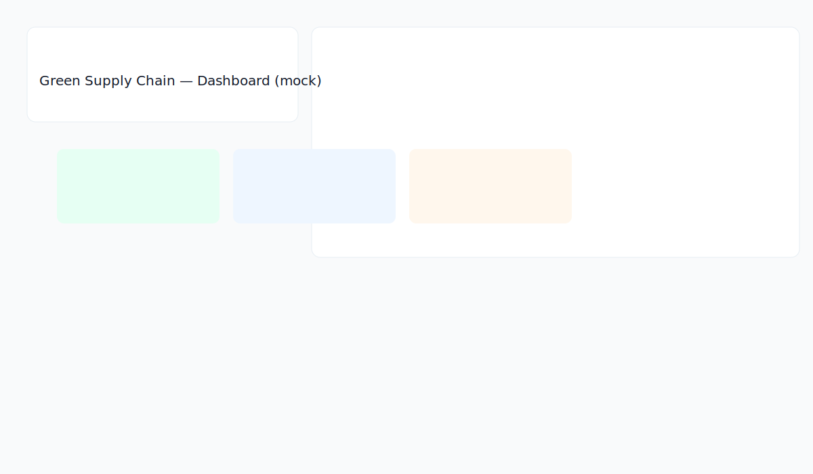
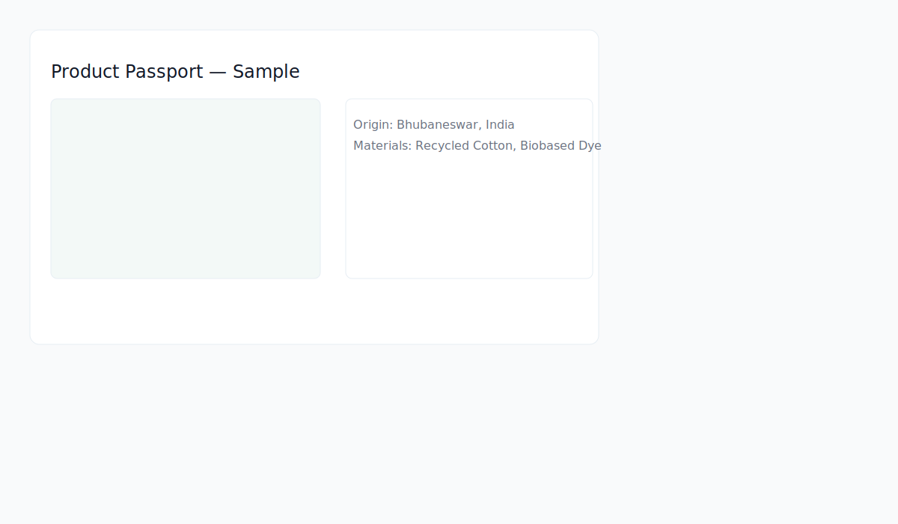

# 🌱 Green Supply Chain Tracker

> **An Angular 18 portfolio project demonstrating modern frontend development skills**

A comprehensive web application for tracking supply chain sustainability, carbon emissions, and product transparency. Built with Angular 18, TypeScript, and Material Design to showcase production-ready code and best practices.

[](https://angular.io/)
[](https://www.typescriptlang.org/)
[](https://material.angular.io/)
[](LICENSE)

## 📸 Screenshots


*Dashboard with real-time metrics and recent activity*


*Interactive carbon footprint visualization with multiple chart types*

## ✨ Key Features

### 📊 **Supply Chain Timeline**
- Interactive timeline visualization with emissions tracking
- Stage-by-stage carbon footprint breakdown
- Location and timestamp tracking
- Color-coded emission levels (low/medium/high)

### 🌍 **Carbon Footprint Calculator**
- Real-time carbon emissions calculation
- Interactive charts (doughnut, line, bar)
- Breakdown by supply chain stage
- Trend analysis and reduction targets

### 🎫 **Product Passports**
- Digital product passports with QR codes
- Blockchain verification status
- Material composition and certifications
- Interactive maps showing product origin
- Downloadable QR codes

### 👥 **Supplier Management**
- Supplier ratings and certifications
- Interactive map with supplier locations
- Add/Edit/Delete functionality with forms
- Search and filter capabilities

### 📈 **Analytics Dashboard**
- Comprehensive metrics and KPIs
- Multiple chart types (bar, doughnut, line)
- Aggregated emissions data
- Project performance tracking

### 🎨 **Modern UI/UX**
- Responsive mobile-first design
- Smooth CSS animations and transitions
- Material Design components
- Dark/light theme support
- Accessibility (ARIA) compliant

## 🛠️ Technology Stack

### Core Technologies
- **Angular 18** - Latest version with standalone components
- **TypeScript 5.5** - Strict mode enabled
- **RxJS 7.8** - Reactive programming and state management
- **SCSS** - Advanced styling with CSS custom properties

### UI Framework & Libraries
- **Angular Material 18** - Material Design components
- **Chart.js 4.4** - Data visualization
- **ng2-charts 6.0** - Angular wrapper for Chart.js
- **Leaflet 1.9** - Interactive maps
- **QRCode 1.5** - QR code generation

### Development Tools
- **Angular CLI 18** - Project scaffolding and build tools
- **Vite** - Fast development server
- **ESLint** - Code linting
- **Prettier** - Code formatting

## 🚀 Getting Started

### Prerequisites
- **Node.js** 18.x or higher
- **npm** 9.x or higher
- **Angular CLI** 18.x (optional, but recommended)

### Installation

1. **Clone the repository**
```bash
git clone <your-repo-url>
cd sustainable-ai-dashboard
```

2. **Install dependencies**
```bash
npm install
```

3. **Run the development server**
```bash
npm start
# or
ng serve
```

4. **Open your browser**
Navigate to `http://localhost:4200`

The application will automatically reload when you make changes to the source files.

### Build for Production

```bash
npm run build
# or
ng build --configuration production
```

The build artifacts will be stored in the `dist/` directory.

### Running Tests

```bash
# Unit tests
npm test

# E2E tests
npm run e2e
```

## 🗂️ Project structure (important files)

- `src/app/pages` — feature pages (dashboard, timeline, carbon, passport, suppliers, analytics)
- `src/app/services/api.service.ts` — mock API with Observables ready to be swapped for a real backend
- `src/assets/mock` — JSON mock datasets you can extend
- `src/styles.scss` — design tokens and shared layout utilities (primary green, secondary blue, accent orange)

## 📦 What I built (portfolio talking points)

- Demonstrates Angular 18 modern patterns (standalone components, signals/observables)
- Includes a real-feeling data layer with mock responses for timeline, passport and supplier datasets
- UI-ready for charts & maps — code is prepared to accept Chart.js, ng2-charts, and Leaflet integration
- Clean, responsive, accessible layouts and component structure ready for extension

## ✅ Next steps (if you want me to continue)

- Integrate Chart.js/ng2-charts for live charts on the analytics and carbon tracker pages
- Add Leaflet maps to product passports and supplier views
- Implement reactive, validation-rich forms for supplier CRUD operations
- Add unit & e2e tests to verify key flows

---

If you'd like I can keep building the 24–48 hour fully-featured version (charts, maps, modals, advanced filtering, CSV/PDF export) — tell me which features you want prioritized and I’ll continue.

## 📸 Screenshots

Below are example screenshots for the key features — replace these with real screenshots from your local runs or a production deployment for your repo.






